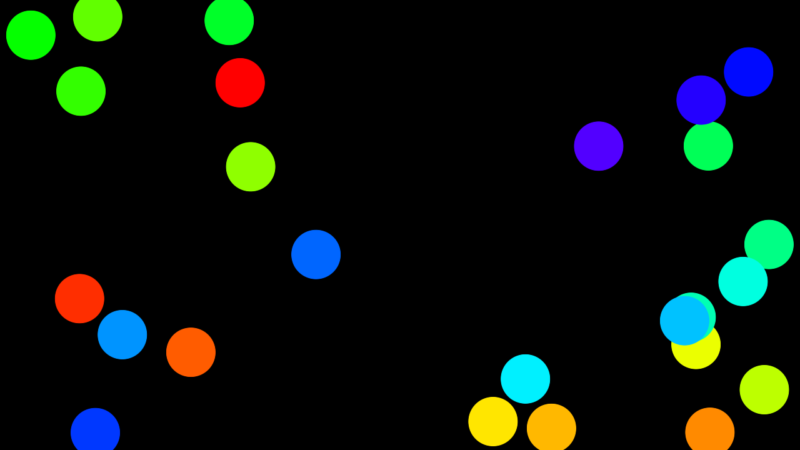
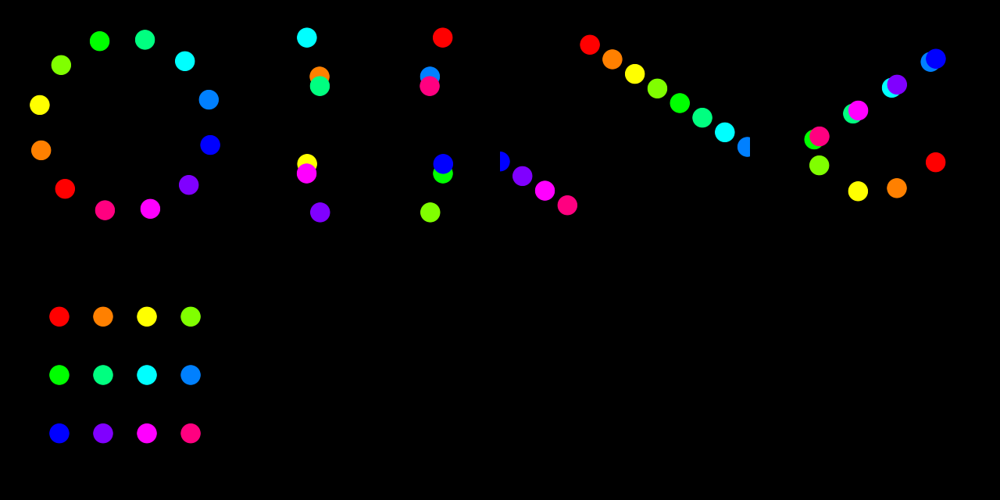
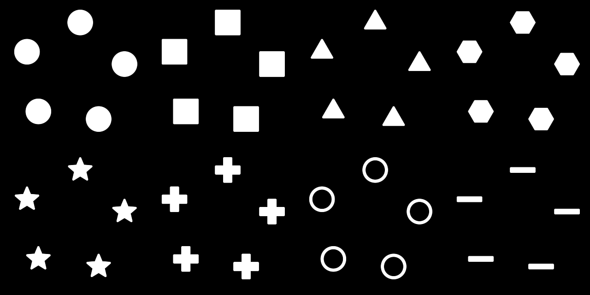

# Orrery user guide

Orrery draws **primitive shapes moving on deterministic paths**, for
[Resolume](https://resolume.com) Arena and Avenue as a pair of FFGL plugins, and again as an
OpenFX plugin for Resolve, Nuke, Natron and Vegas. It is for quick animated masks, and for chroma
animations driving a pixel map.



*Twelve circles on a 3:2 Lissajous, hue spread across the set.*

> **Before you rely on this:** the motion is measured rather than asserted — 47 instances landed
> within 1.5 px of an independent prediction across 5 paths and 4 aspect ratios; circles stay round
> to 0.00% and correctly sized to 0.01% at 1:1, 16:9, portrait and 2.39:1; each of the 4 mask modes
> was checked inside a shape and outside it; and all 46 parameters change the picture.
>
> **Both plugins load and run in Resolume Arena 7.27.1.** The shipped Windows build is checked
> in a real Arena at every release: that each registers with the right name, uid and category,
> that all 52 controls the host reports match the ones declared — name, order, type, range and
> default — and that 42 of them demonstrably move the picture. That check runs on software
> rendering, so it says nothing about an NVIDIA or AMD driver, and the machine has no sound
> device, so the three audio-driven controls are unverified. Whether Bar sync locks against a
> real transport still needs a real transport. Try it on a spare layer first.
>
> This codebase was created with AI assistance, directed and reviewed by a human author.

---

## Installing

Both plugins are in every download. Drop them into `~/Documents/Resolume Arena/Extra Effects` (or
the Avenue equivalent) and restart Resolume. The macOS builds are Developer ID-signed and
notarised; the Windows builds are unsigned, and only the installer trips SmartScreen.

For OpenFX hosts, copy `Orrery.ofx.bundle` into `/Library/OFX/Plugins` (macOS),
`C:\Program Files\Common Files\OFX\Plugins` (Windows) or `/usr/OFX/Plugins`
(Linux) — one bundle carries both plugins. It is the
identical motion, linking the same code the harness measures. There is no Audio group there; OFX
hosts have no audio analysis.

| | |
|---|---|
| **Orrery** | A generator. Shapes over their own background. |
| **Orrery Mask** | An effect. The same shapes over — or cut into — the incoming clip. |

---

## The two jobs it is for

**Quick animated masks.** Shapes over black used as a luma mask, layered with a blend mode, or
applied straight to a clip with *Orrery Mask*.

**Chroma animations for pixel mapping.** Point Resolume's pixel mapper at a composition running
Orrery and the shapes become the lights. **Grid** lays shapes out on a fixture grid, **Hue Spread**
gives every one its own colour, and **Sync** locks the whole chase to the track.

If you are pixel mapping, **set Softness to zero**. A feathered edge means a fixture sitting on the
boundary reads a half-brightness colour that was never in the design.

---

## Why the motion never drifts

An instance's placement is a **pure function of (index, phase)**. Nothing is integrated frame by
frame, so nothing accumulates error and nothing slows down when the show gets heavy — which
matters rather more when the output is driving a lighting rig than when it is driving a screen.

The same property is why beat sync costs nothing extra: phase is just a number, so **Sync** swaps
the host clock for the host's bar position with no separate code path. Set it to **Manual** and
the Phase parameter becomes the only driver — hand it to Resolume's own BPM-synced animation, a
keyframe, or a MIDI fader.

---

## Paths



| Path | What it does |
|---|---|
| **Orbit** | A circle. With Spread up, a chase around it. |
| **Lissajous** | Two frequency ratios. Whole-number ratios close and repeat; a ratio slightly off a whole number precesses, so the pattern stays interesting for hours. |
| **Drift** | Travel at a heading, wrapping at the edges. Wipes, bars crossing a rig. |
| **Bounce** | Reflection off the frame edges. Scatter detunes the axes per shape for independent wandering. |
| **Grid** | Fixed positions on a grid. The animation is the pulse — made for pixel mapping onto a fixture layout. |

**Spread** distributes the instances along the path in phase — that is what turns a clump into a
chase. **Scatter** blends that even spread towards a hashed one, from metronome to swarm.

The Lissajous note is worth acting on: set a ratio *slightly* off a whole number and the figure
never quite repeats, which is what you want behind a long set.

---

## Shapes



Circle, Square, Triangle, Hexagon, Star, Cross, Ring, Bar — each with **Roundness**, **Outline**,
**Stretch**, **Softness** and **Shade**.

**Roundness** sets corner rounding on everything except **Ring**, where it sets the ring's
thickness.

**Shade** lights the shape as though it had been inflated, with **Light** setting where the light
comes from — one full turn over the slider, a quarter of the way up being straight down from the
top. The normal is read out of the same distance field that draws the shape, so a **Circle** is
exactly a sphere; the other primitives round the way their own field says they should, which makes
a **Star** faceted and a **Triangle** barely domed at all. It is off by default, and a shape with
Shade at zero renders exactly as it did before the control existed.

---

## Audio

Pick an audio source on the **Audio** parameter and **every shape gets its own slice of the
spectrum**, low frequencies first. **Audio Size** grows each shape with its band; **Audio Bright**
fades quiet shapes towards nothing.

On a **Grid** with Audio Bright up, the shapes *are* a spectrum analyser — and because the bands
arrive per instance, this is the one thing Resolume's own per-parameter audio link cannot do: that
link moves one slider for the whole plugin, this moves sixty-four shapes independently.

The bands are smoothed fast-up, slow-down (~150 ms release), so a hit lands the frame it happens
and dies away like a meter rather than flickering.

---

## Mask modes

*Orrery Mask* adds four ways of combining the shapes with the clip:

| Mode | Result |
|---|---|
| **Over** | Shapes drawn on top, in their own colours. |
| **Reveal** | The clip shows **only** where the shapes are. |
| **Hide** | The clip shows **everywhere except** the shapes. |
| **Colourise** | The clip, tinted by the shape colour, inside the shapes. |

**Colourise needs a Colour Mode other than White to do anything visible** — against a white shape
colour it is arithmetically identical to Reveal.

---

## If it looks wrong

**Colourise looks exactly like Reveal.** The shape colour is white. See above.

**The chase is a clump.** **Spread** is at zero — that is the control that distributes instances
along the path in phase.

**Fixtures on the edge of a shape read the wrong colour.** **Softness**. Set it to zero for pixel
mapping.

**Nothing renders at all.** A shader that will not compile looks exactly like a plugin that does
nothing. The log says which:

```
~/Library/Logs/orrery/orrery.YYYY-MM-DD.log
```
